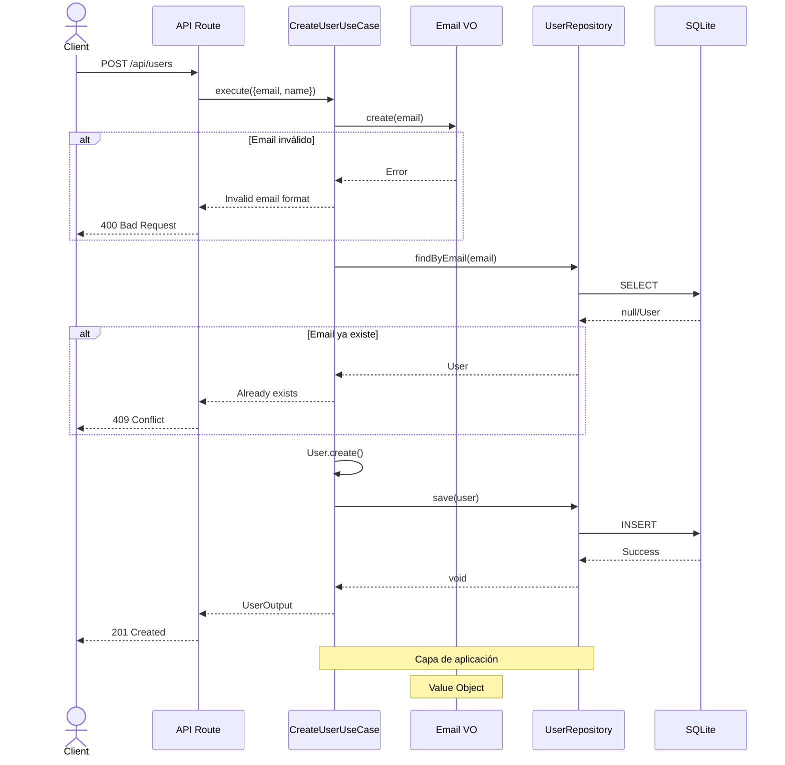

# Creación de Usuarios

Sistema de creación de usuarios con validación de email y arquitectura DDD.

## Flujo de Creación



El `CreateUserUseCase` valida el email, verifica que no exista duplicado y persiste el usuario:

```typescript
import { container } from '@/core/config/container';

const user = await container.useCases.user.create.execute({
  email: 'usuario@ejemplo.com',
  name: 'Juan Pérez'
});
```

## Validaciones

| Regla | Error |
|-------|-------|
| Email formato RFC 5322 | `Invalid email format` |
| Email único | `User with this email already exists` |
| Nombre no vacío | `User name cannot be empty` |

## Uso en API

**Endpoint**: `POST /api/users`

```typescript
// Request
{
  "email": "usuario@ejemplo.com",
  "name": "Juan Pérez"
}

// Response (201)
{
  "id": "550e8400-e29b-41d4-a716-446655440000",
  "email": "usuario@ejemplo.com",
  "name": "Juan Pérez",
  "createdAt": "2025-12-12T10:30:00Z",
  "updatedAt": "2025-12-12T10:30:00Z"
}
```

**Códigos HTTP**:
- `201` - Usuario creado exitosamente
- `400` - Datos inválidos (email/nombre)
- `409` - Email ya registrado
- `500` - Error del servidor

## Arquitectura

1. **Domain**: `User`, `Email`, `UserId` (value objects inmutables)
2. **Application**: `CreateUserUseCase` (lógica de negocio)
3. **Infrastructure**: `SQLiteUserRepository` (persistencia)
4. **UI**: Endpoint API en SvelteKit

Los Value Objects garantizan validación automática y previenen estados inválidos.
