import { Tabs, TabItem } from '@astrojs/starlight/components';

# Creación de Usuarios

Esta guía demuestra cómo crear usuarios en la aplicación siguiendo la arquitectura DDD (Domain-Driven Design). El sistema valida automáticamente el formato del email y garantiza la unicidad de cada usuario.

## Arquitectura

El proceso de creación de usuarios sigue el patrón de capas DDD:

1. **Domain Layer**: `User`, `Email`, `UserId` - Entidades y Value Objects
2. **Application Layer**: `CreateUserUseCase` - Orquestación de la lógica de negocio
3. **Infrastructure Layer**: `SQLiteUserRepository` - Persistencia en base de datos
4. **UI Layer**: API Routes y componentes Svelte

## API del Use Case

### `CreateUserUseCase.execute(input)`

Crea un nuevo usuario con validación de email y verificación de unicidad.

| Parámetro     | Tipo     | Requerido | Descripción                      |
| ------------- | -------- | --------- | -------------------------------- |
| `input.email` | `string` | ✅        | Email válido (formato RFC 5322)  |
| `input.name`  | `string` | ✅        | Nombre completo (no vacío)       |

**Retorna**: `Promise<CreateUserOutput>` - Usuario creado con ID generado

```typescript
interface CreateUserOutput {
  id: string;           // UUID v4
  email: string;        // Email validado
  name: string;         // Nombre (sin espacios extra)
  createdAt: Date;      // Timestamp de creación
  updatedAt: Date;      // Timestamp de actualización
}
```

**Errores posibles**:

- `Invalid email format` - Email con formato inválido
- `User with this email already exists` - Email duplicado
- `User name cannot be empty` - Nombre vacío o solo espacios

## Validaciones Automáticas

### Email (Value Object)

El email se valida automáticamente usando el Value Object `Email`:

```typescript
// ✅ Válido
Email.create('user@example.com');

// ❌ Lanza Error: "Invalid email format"
Email.create('invalid-email');
Email.create('');
Email.create('user@');
```

### Nombre de Usuario

El nombre se limpia automáticamente (elimina espacios extra):

```typescript
// Input: "  John Doe  "
// Output: "John Doe"

// ❌ Lanza Error: "User name cannot be empty"
User.create({ name: '' });
User.create({ name: '   ' });
```

### Unicidad de Email

El sistema verifica que no exista otro usuario con el mismo email antes de crear uno nuevo.

## Flujo de Creación

El siguiente diagrama muestra el proceso completo de validación y creación de un usuario:

```mermaid
flowchart TD
    Start([POST /api/users]) --> ValidateInput{¿Campos<br/>requeridos?}
    
    ValidateInput -->|No| E1[400 Bad Request<br/>Email and name required]
    ValidateInput -->|Sí| ValidateEmail{¿Email<br/>válido?}
    
    ValidateEmail -->|No| E2[400 Bad Request<br/>Invalid email format]
    ValidateEmail -->|Sí| CheckExists{¿Email<br/>existe?}
    
    CheckExists -->|Sí| E3[409 Conflict<br/>Email already exists]
    CheckExists -->|No| ValidateName{¿Nombre<br/>válido?}
    
    ValidateName -->|No vacío| GenerateId[Generar UUID]
    ValidateName -->|Vacío| E4[400 Bad Request<br/>Name cannot be empty]
    
    GenerateId --> CreateEntity[Crear entidad User]
    CreateEntity --> CleanName[Limpiar espacios<br/>del nombre]
    CleanName --> SaveDB[(Guardar en DB)]
    
    SaveDB -->|Error| E5[500 Server Error<br/>Database failure]
    SaveDB -->|Éxito| Success[201 Created<br/>Retorna usuario]
    
    E1 --> End([Fin])
    E2 --> End
    E3 --> End
    E4 --> End
    E5 --> End
    Success --> End
    
    style ValidateInput fill:#fff3cd,stroke:#856404
    style ValidateEmail fill:#fff3cd,stroke:#856404
    style CheckExists fill:#fff3cd,stroke:#856404
    style ValidateName fill:#fff3cd,stroke:#856404
    style E1 fill:#f8d7da,stroke:#721c24
    style E2 fill:#f8d7da,stroke:#721c24
    style E3 fill:#f8d7da,stroke:#721c24
    style E4 fill:#f8d7da,stroke:#721c24
    style E5 fill:#f8d7da,stroke:#721c24
    style Success fill:#d4edda,stroke:#155724
    style SaveDB fill:#e1f5fe,stroke:#01579b
```



**Leyenda**:
- 🟡 **Amarillo**: Puntos de decisión/validación
- 🔴 **Rojo**: Errores (con código HTTP)
- 🟢 **Verde**: Creación exitosa
- 🔵 **Azul**: Operación de base de datos

## Ejemplos de Uso

<Tabs>
<TabItem label="API Route">

```typescript
// src/routes/api/users/+server.ts
import { json } from '@sveltejs/kit';
import type { RequestHandler } from './$types';
import { container } from '$core/config/container';

export const POST: RequestHandler = async ({ request }) => {
  try {
    const body = await request.json();

    // Validación básica de entrada
    if (!body.email || !body.name) {
      return json(
        { message: 'Email and name are required' },
        { status: 400 }
      );
    }

    // Ejecutar el use case
    const user = await container.useCases.user.create.execute({
      email: body.email,
      name: body.name
    });

    return json(user, { status: 201 });
  } catch (err) {
    if (err instanceof Error) {
      // Email duplicado
      if (err.message.includes('already exists')) {
        return json({ message: err.message }, { status: 409 });
      }
      // Email inválido
      if (err.message.includes('Invalid email')) {
        return json({ message: err.message }, { status: 400 });
      }
    }
    console.error('Error creating user:', err);
    return json({ message: 'Failed to create user' }, { status: 500 });
  }
};
```

</TabItem>

<TabItem label="Form Action">

```typescript
// src/routes/users/+page.server.ts
import { fail, redirect } from '@sveltejs/kit';
import type { Actions } from './$types';
import { container } from '$core/config/container';

export const actions: Actions = {
  create: async ({ request }) => {
    const data = await request.formData();
    const email = data.get('email')?.toString();
    const name = data.get('name')?.toString();

    // Validación de entrada
    if (!email || !name) {
      return fail(400, {
        error: 'Email and name are required',
        email,
        name
      });
    }

    try {
      // Crear usuario
      await container.useCases.user.create.execute({ email, name });
      
      // Redirigir a la lista de usuarios
      throw redirect(303, '/users');
    } catch (err) {
      if (err instanceof Error) {
        return fail(400, {
          error: err.message,
          email,
          name
        });
      }
      throw err;
    }
  }
};
```

</TabItem>

<TabItem label="Cliente Fetch">

```typescript
// Desde cualquier componente Svelte o script
async function createUser(email: string, name: string) {
  try {
    const response = await fetch('/api/users', {
      method: 'POST',
      headers: { 'Content-Type': 'application/json' },
      body: JSON.stringify({ email, name })
    });

    if (!response.ok) {
      const error = await response.json();
      throw new Error(error.message || 'Failed to create user');
    }

    const user = await response.json();
    console.log('User created:', user);
    return user;
  } catch (error) {
    console.error('Error:', error);
    throw error;
  }
}

// Uso
await createUser('john@example.com', 'John Doe');
```

</TabItem>

<TabItem label="Componente Svelte 5">

```svelte
<script lang="ts">
  import { Button } from '$lib/components/ui/button';
  import { Input } from '$lib/components/ui/input';
  import { Label } from '$lib/components/ui/label';
  import { toast } from 'svelte-sonner';

  let email = $state('');
  let name = $state('');
  let loading = $state(false);

  async function handleSubmit(e: Event) {
    e.preventDefault();
    loading = true;

    try {
      const response = await fetch('/api/users', {
        method: 'POST',
        headers: { 'Content-Type': 'application/json' },
        body: JSON.stringify({ email, name })
      });

      if (response.ok) {
        toast.success('Usuario creado exitosamente');
        // Limpiar formulario
        email = '';
        name = '';
      } else {
        const error = await response.json();
        toast.error(error.message || 'Error al crear usuario');
      }
    } catch (err) {
      toast.error('Error de conexión');
    } finally {
      loading = false;
    }
  }
</script>

<form onsubmit={handleSubmit} class="space-y-4">
  <div class="space-y-2">
    <Label for="name">Nombre</Label>
    <Input
      id="name"
      bind:value={name}
      placeholder="John Doe"
      required
      disabled={loading}
    />
  </div>

  <div class="space-y-2">
    <Label for="email">Email</Label>
    <Input
      id="email"
      type="email"
      bind:value={email}
      placeholder="john@example.com"
      required
      disabled={loading}
    />
  </div>

  <Button type="submit" disabled={loading}>
    {loading ? 'Creando...' : 'Crear Usuario'}
  </Button>
</form>
```

</TabItem>
</Tabs>

## Manejo de Errores

### Códigos de Estado HTTP

| Código | Significado              | Causa                             |
| ------ | ------------------------ | --------------------------------- |
| `201`  | Created                  | Usuario creado exitosamente       |
| `400`  | Bad Request              | Email inválido o nombre vacío     |
| `409`  | Conflict                 | Email ya existe en el sistema     |
| `500`  | Internal Server Error    | Error en base de datos o servidor |

### Ejemplos de Respuestas de Error

```json
// Email inválido (400)
{
  "message": "Invalid email format: not-an-email"
}

// Email duplicado (409)
{
  "message": "User with this email already exists"
}

// Campos faltantes (400)
{
  "message": "Email and name are required"
}
```

## Flujo Completo


## Testing

### Test Unitario del Use Case

```typescript
// src/core/application/user/CreateUserUseCase.spec.ts
import { describe, it, expect, vi, beforeEach } from 'vitest';
import { CreateUserUseCase } from './CreateUserUseCase';
import type { UserRepository } from '../../domain/user/UserRepository';

describe('CreateUserUseCase', () => {
  let mockRepository: UserRepository;
  let useCase: CreateUserUseCase;

  beforeEach(() => {
    mockRepository = {
      findByEmail: vi.fn().mockResolvedValue(null),
      save: vi.fn().mockResolvedValue(undefined),
      // ... otros métodos
    };
    useCase = new CreateUserUseCase(mockRepository);
  });

  it('should create user with valid data', async () => {
    const input = {
      email: 'test@example.com',
      name: 'Test User'
    };

    const result = await useCase.execute(input);

    expect(result.email).toBe('test@example.com');
    expect(result.name).toBe('Test User');
    expect(result.id).toBeDefined();
    expect(mockRepository.save).toHaveBeenCalledOnce();
  });

  it('should throw error if email already exists', async () => {
    mockRepository.findByEmail = vi.fn().mockResolvedValue({
      /* existing user */
    });

    await expect(
      useCase.execute({
        email: 'existing@example.com',
        name: 'Test'
      })
    ).rejects.toThrow('User with this email already exists');
  });

  it('should throw error for invalid email', async () => {
    await expect(
      useCase.execute({
        email: 'invalid-email',
        name: 'Test'
      })
    ).rejects.toThrow('Invalid email format');
  });
});
```

### Test E2E con Playwright

```typescript
// e2e/create-user/create-valid-user.spec.ts
import { test, expect } from '@playwright/test';

test.describe('Create User Flow', () => {
  test('should create user with valid data', async ({ page }) => {
    await page.goto('/users');

    // Abrir diálogo de creación
    await page.getByRole('button', { name: 'Add User' }).click();

    // Llenar formulario
    await page.getByLabel('Name').fill('John Doe');
    await page.getByLabel('Email').fill('john.doe@example.com');

    // Enviar formulario
    await page.getByRole('button', { name: 'Create User' }).click();

    // Verificar toast de éxito
    await expect(page.getByText('User created successfully')).toBeVisible();

    // Verificar que el usuario aparece en la tabla
    await expect(page.getByText('John Doe')).toBeVisible();
    await expect(page.getByText('john.doe@example.com')).toBeVisible();
  });

  test('should show error for duplicate email', async ({ page }) => {
    await page.goto('/users');

    // Crear primer usuario
    await page.getByRole('button', { name: 'Add User' }).click();
    await page.getByLabel('Name').fill('First User');
    await page.getByLabel('Email').fill('duplicate@example.com');
    await page.getByRole('button', { name: 'Create User' }).click();
    await expect(page.getByText('User created successfully')).toBeVisible();

    // Intentar crear usuario con email duplicado
    await page.getByRole('button', { name: 'Add User' }).click();
    await page.getByLabel('Name').fill('Second User');
    await page.getByLabel('Email').fill('duplicate@example.com');
    await page.getByRole('button', { name: 'Create User' }).click();

    // Verificar error
    await expect(
      page.getByText(/already exists/i)
    ).toBeVisible();
  });
});
```

## Mejores Prácticas

1. **Siempre validar entrada del cliente** antes de llamar al use case
2. **Usar códigos HTTP apropiados** (201 para creación, 409 para conflictos)
3. **Capturar errores específicos** y proporcionar mensajes claros
4. **Limpiar formularios** después de creación exitosa
5. **Mostrar feedback visual** (toasts, loading states)
6. **Sanitizar entrada** (el sistema ya elimina espacios extra del nombre)

## Próximos Pasos

- [Actualizar Usuarios](/guides/actualizar-usuarios)
- [Eliminar Usuarios](/guides/eliminar-usuarios)
- [Listar Usuarios](/guides/listar-usuarios)
- [Arquitectura DDD](/guides/architecture)
